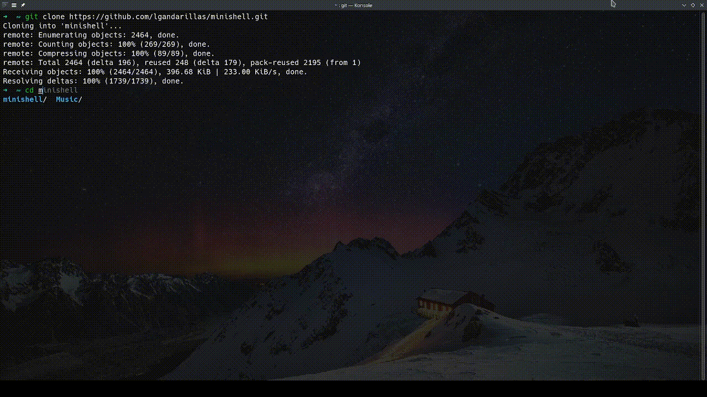

# Minishell

A shell inspired by bash, developed as part of the 42 curriculum. This shell interprets and executes commands, handles pipes and redirections, and includes a set of built-in commands.
<br><br>
This project was developed collaboratively by [@alejandquintero](https://github.com/alejandquintero) and [@lgandarillas](https://github.com/lgandarillas).

## Overview

Minishell is designed to:
- Parse and execute commands with arguments.
- Handle absolute, relative, and environment paths.
- Provide support for pipes (`|`) and redirections (`<`, `>`, `>>`, `<<`).
- Include environment variable handling (`$VAR` and `$?`).
- Support interactive shell control with `Ctrl-C`, `Ctrl-D`, and `Ctrl-\`.



## Setup and Usage

1. Clone the repository and submodules
	```bash
	git clone https://github.com/lgandarillas/minishell.git
	```
	```bash
	cd minishell
	```
    ```
    git submodule update --init --remote libft_v2
    ```

2. Install Dependecies
    ```bash
    sudo apt update
    sudo apt install libreadline-dev
    ```

3. Compile the project:
	```bash
	make
	```

4. Run the shell:
	```bash
	./mnishell
	```

## Features

### Built-in Commands
Minishell implements the following built-in functions directly without external executables:
- `echo`, `cd`, `pwd`, `export`, `unset`, `env`, `exit`

### Additional Features
- **Quoting**: Supports single (`'`) and double (`"`) quotes for string handling.
- **History**: Tracks command history during the session.
- **Signals**: Handles `Ctrl-C`, `Ctrl-D`, and `Ctrl-\` like bash.
- **Environment Variables**: Expands `$VAR` and includes support for `$?` (last exit status).
